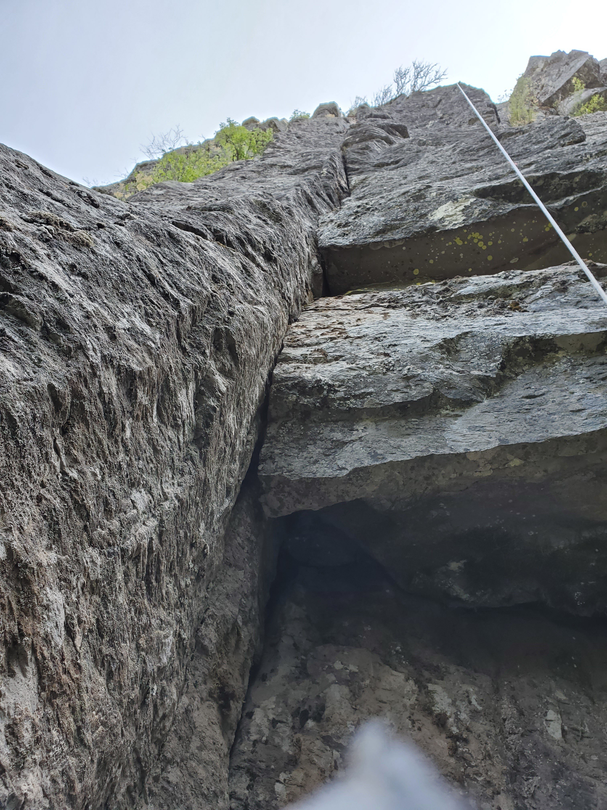

# Description
This cracks offers plenty of wide jamming and some decent mandatory offwidth.  

Start on the right edge of the mossy platform, straight up to get your first piece, then traverse left to the hand crack.  Keep going straight up passed the roof where the wide climbing starts.  Save everything bigger than #.75 for after the roof.  Long sleeves are helpful.

A 60m will get you down IF the belayer stands on the narrow platform close to the wall.  Tie a stopper knot at the end of the rope. 

# Location
Enter the woods by following the trail left of Qatari Ardah. The huge pillar forming a roof should be obvious enough.

# Protection
Singles to C4 #5, double of #.75, triple of #4, one tiny 10mm cam for the first move (Blue Alien or Green C3). A fourth #4 would be useful, but you don't need if you place conservatively. Bolted anchor.

# Pictures

