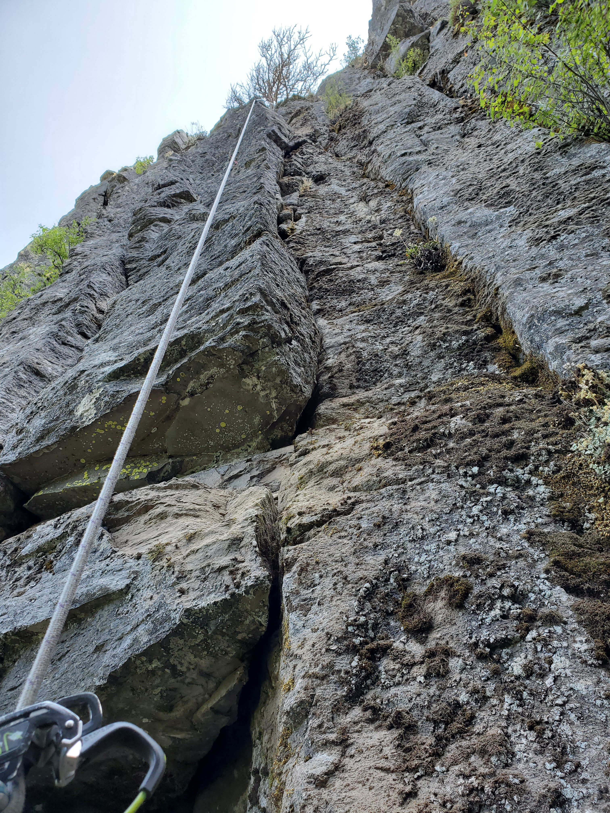

# Description
This cracks offers plenty of satisfying jams of all sizes from fingers to fists.  There is one small offwidth pod that can easily be passed by using side features if you don't fancy wedging yourself that deep inside the crack.

Start on the right edge of the mossy platform, straight up to get your first piece, then traverse left to the hand crack.  Keep going straight up to the roof, traverse right under the roof, pass the bulge, then enjoy the wide climbing.  Long sleeves are helpful.

A 60m will get you down IF the belayer stands on the narrow platform close to the wall.  Tie a stopper knot at the end of the rope. 

# Location
Enter the woods by following the trail left of Qatari Ardah. The huge pillar forming a roof should be obvious enough.

# Protection
Doubles to C4 #4, one tiny 10mm cam for the first move (Blue Alien or Green C3). Optional: C4 #5.

# Pictures

